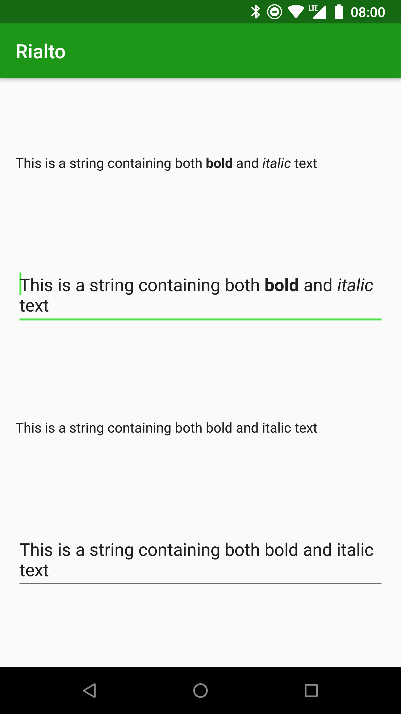

[  ](https://bintray.com/stylingandroid/rialto/library/_latestVersion)

### Rialto

_Rialto_ is an Android text styling library based upon Annotation Spans. Rialto enables you to provide consistent text
formatting throughout your app by using annotations in your string resources.

To use Rialto you need to do two things: Firstly you need to initialise the Rialto framework and register  the Spans which will get applied for specific key / value pairs in your annotations; Secondly you need to add annotations to your string resources using those key / value pairs and Rialto will do the rest.

Rialto comes in three flavours depending on whether you're using the legacy Support AppCompat library, AndroidX AppCompat library, or Material components library. It does not currently support apps which use legacy framework themes as it is assumed that most modern apps or using either AppCompat or Material components (which currently depends on AndroidX AppCompat). In this example, we will look at how to use the AndroidX AppCompat version, but there are also examples of using the other flavours in the sample projects within the GitHub repo.

Rialto is published to JCenter, so if you haven't already gort the JCenter repo configured in your build script, then you'll need to add it:

```groovy
buildscript {
    repositories {
        ...
        jcenter()
    }
}
```

The first thing to do is to add the necessary dependency to your project:

```groovy
dependencies {
    ...
    implementation 'com.stylingandroid.rialto:rialto-androidx:1.0.0'
    ...
}
```

If you are using the legacy AppCompat library use the artifact named <code>rialto-support</code> instead; alternatively, if you're using the Material components library use <code>rialto-material</code>.

By far the easiest way to implement Rialto is to use <em>RialtoActivity</em> as the base class for your <em>Activity</em>. Don't worry that you need to extend <em>AppCompatActivity</em> - RialtoActivity is a subclass of that, so you'll automatically get it. The version of <em>AppCompatActivity</em> which will be used will depend upon the flavour of Rialto that you're using. For example rialto-androidx subclasses <em>AppCompatActivity</em> from the Android X version of AppCompat. There is also a way of implementing Rialto without subclassing <em>RialtoActivity</em>, and we'll look at that in a future article.

The next thing that we need to do is register some factories which will be used to create spans whenever annotations are found with specific key /value pairs. It is important to do this before we inflate any layouts because the Rialto framework will perform text formatting during layout inflation, and we therefore need to register these factories first in order to apply the correct formatting. This example shows how we can register a couple of span types to handle bold and italic (yes, I realise that we can already apply these styles using &lt;b&gt; and &lt;i&gt; in our text resources, but the value behind re-implementing these using annotations will become apparent as we explore some slightly more complex examples):

```kotlin
class MainActivity : RialtoActivity() {

    override fun onCreate(savedInstanceState: Bundle?) {
        super.onCreate(savedInstanceState)
        factory.apply {
            registerSpan("format", "bold") { StyleSpan(Typeface.BOLD) }
            registerSpan("format", "italic") { StyleSpan(Typeface.ITALIC) }
        }
        setContentView(R.layout.activity_main)
    }
}
```

<em>RialtoActivity</em> has a field named factory which is where we perform our registrations, and then we register a couple of span types to specific key value pairs. The lambda is a simple factory method which will create a span of the correct type. This example registers two spans: The first will be applied to any annotation with a key of "format" and a value of "bold" and will apply a bold StyleSpan to the text included within the annotation; the second will will be applied to any annotation with a key of "format" and a value of "italic" and will apply an italic StyleSpan to the text included within the annotation.

Now we create a Layout with a single <em>TextView</em>:

```xml
<?xml version="1.0" encoding="utf-8"?>
<androidx.constraintlayout.widget.ConstraintLayout xmlns:android="http://schemas.android.com/apk/res/android"
  xmlns:app="http://schemas.android.com/apk/res-auto"
  xmlns:tools="http://schemas.android.com/tools"
  android:layout_width="match_parent"
  android:layout_height="match_parent"
  tools:context="com.stylingandroid.rialto.kotlin.MainActivity">

  <TextView
    android:layout_width="0dp"
    android:layout_height="wrap_content"
    android:layout_margin="16dp"
    android:text="@string/main_text"
    app:layout_constraintBottom_toBottomOf="parent"
    app:layout_constraintLeft_toLeftOf="parent"
    app:layout_constraintRight_toRightOf="parent"
    app:layout_constraintTop_toTopOf="parent" />

</androidx.constraintlayout.widget.ConstraintLayout>
```

The string resource with the id <code>@string/main_text</code> that we use for this <em>TextView</em> looks like this:

```xml
<resources>
    ...
    <string name="main_text">This is a string containing both <annotation format="bold">bold</annotation> and <annotation format="italic">italic</annotation> text</string>
    ...
</resources>
```
Note how the attributes of the <code>&lt;annotation ...&gt;</code> elements matches the key / value pairs that we registered earlier.

That's all we need to do, there's no need to manually do any processing, Rialto does it for us:


It also works for EditText:

```xml
<?xml version="1.0" encoding="utf-8"?>
<androidx.constraintlayout.widget.ConstraintLayout xmlns:android="http://schemas.android.com/apk/res/android"
    xmlns:app="http://schemas.android.com/apk/res-auto"
    xmlns:tools="http://schemas.android.com/tools"
    android:layout_width="match_parent"
    android:layout_height="match_parent"
    tools:context="com.stylingandroid.rialto.kotlin.MainActivity">

    <TextView
        android:id="@+id/formatted_text_view"
        android:layout_width="0dp"
        android:layout_height="wrap_content"
        android:layout_margin="16dp"
        android:text="@string/main_text"
        app:layout_constraintBottom_toTopOf="@id/formatted_edit_text"
        app:layout_constraintLeft_toLeftOf="parent"
        app:layout_constraintRight_toRightOf="parent"
        app:layout_constraintTop_toTopOf="parent" />

    <EditText
        android:id="@+id/formatted_edit_text"
        android:layout_width="0dp"
        android:layout_height="wrap_content"
        android:layout_margin="16dp"
        android:text="@string/main_text"
        app:layout_constraintBottom_toBottomOf="parent"
        app:layout_constraintLeft_toLeftOf="parent"
        app:layout_constraintRight_toRightOf="parent"
        app:layout_constraintTop_toBottomOf="@+id/formatted_text_view" />

</androidx.constraintlayout.widget.ConstraintLayout>
```

This produces the following:


Of course, you may not always wish to have formatting applied to all of your TextView and EditText instances within the layout. You can disable formatting by setting the annotationFormatting attribute to false:

```xml
<?xml version="1.0" encoding="utf-8"?>
<androidx.constraintlayout.widget.ConstraintLayout xmlns:android="http://schemas.android.com/apk/res/android"
    xmlns:app="http://schemas.android.com/apk/res-auto"
    xmlns:tools="http://schemas.android.com/tools"
    android:layout_width="match_parent"
    android:layout_height="match_parent"
    tools:context="com.stylingandroid.rialto.kotlin.MainActivity">

    <TextView
        android:id="@+id/formatted_text_view"
        android:layout_width="0dp"
        android:layout_height="wrap_content"
        android:layout_margin="16dp"
        android:text="@string/main_text"
        app:layout_constraintBottom_toTopOf="@id/formatted_edit_text"
        app:layout_constraintLeft_toLeftOf="parent"
        app:layout_constraintRight_toRightOf="parent"
        app:layout_constraintTop_toTopOf="parent" />

    <EditText
        android:id="@+id/formatted_edit_text"
        android:layout_width="0dp"
        android:layout_height="wrap_content"
        android:layout_margin="16dp"
        android:text="@string/main_text"
        app:layout_constraintBottom_toTopOf="@id/unformatted_text_view"
        app:layout_constraintLeft_toLeftOf="parent"
        app:layout_constraintRight_toRightOf="parent"
        app:layout_constraintTop_toBottomOf="@+id/formatted_text_view" />

    <TextView
        android:id="@+id/unformatted_text_view"
        android:layout_width="0dp"
        android:layout_height="wrap_content"
        android:layout_margin="16dp"
        android:text="@string/main_text"
        app:annotationFormatting="false"
        app:layout_constraintBottom_toTopOf="@id/unformatted_edit_text"
        app:layout_constraintLeft_toLeftOf="parent"
        app:layout_constraintRight_toRightOf="parent"
        app:layout_constraintTop_toBottomOf="@id/formatted_edit_text"
        tools:ignore="missingPrefix" />

    <EditText
        android:id="@+id/unformatted_edit_text"
        android:layout_width="0dp"
        android:layout_height="wrap_content"
        android:layout_margin="16dp"
        android:text="@string/main_text"
        app:annotationFormatting="false"
        app:layout_constraintBottom_toBottomOf="parent"
        app:layout_constraintLeft_toLeftOf="parent"
        app:layout_constraintRight_toRightOf="parent"
        app:layout_constraintTop_toBottomOf="@+id/unformatted_text_view"
        tools:ignore="missingPrefix"/>

</androidx.constraintlayout.widget.ConstraintLayout>
```

Using this attribute results in a lint warning, so where we use it we may need to disable the missingPrefix warning using tools:ignore="missingPrefix".

We can see how we can selectively apply the formatting:



There's mopre to come in the way of ducumentation, but this should be enough to grasp the basics and get started with Rialto.
